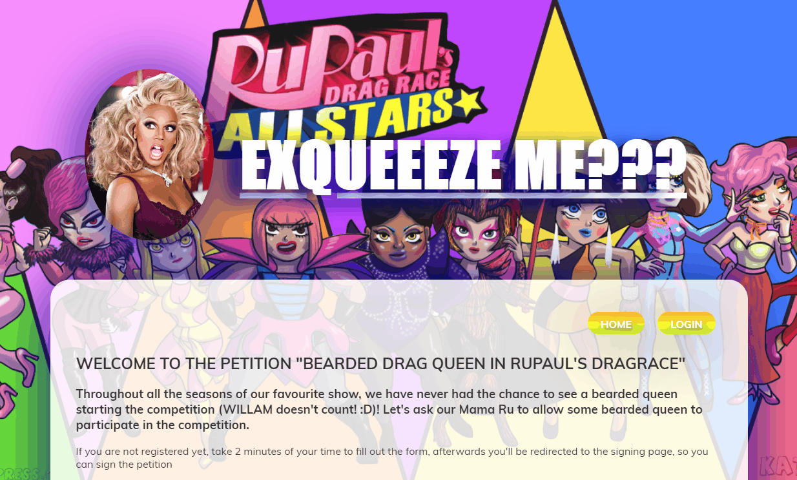
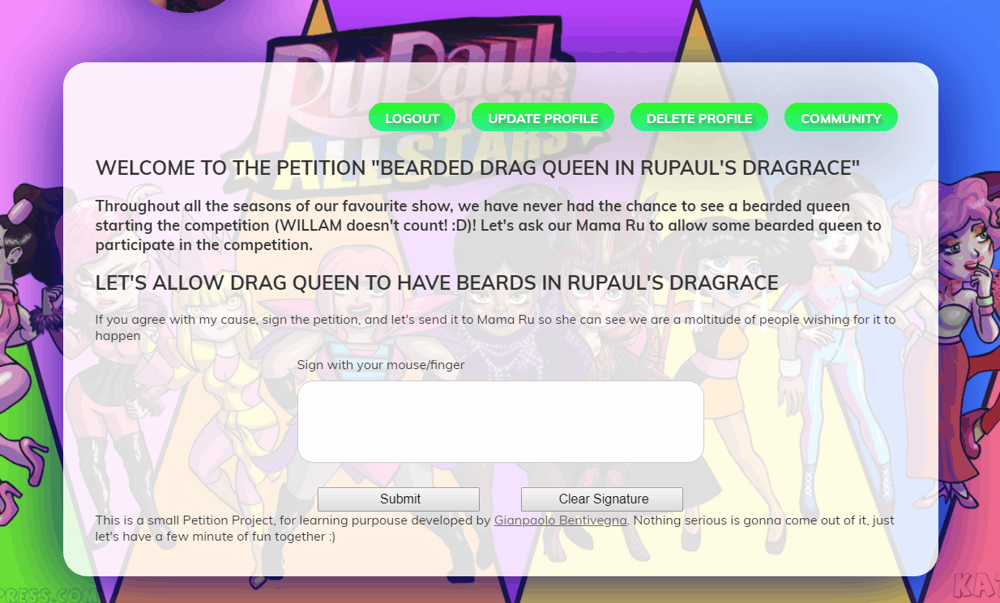

# Petition Project

Social Network for geeks of the american show Rupaul's Drag Race

## Overview

In this Project I'm working on a Petition, where people can sign in or just register and not sign the petition, for a good cause! :)

A live preview of the project can be seen at http://mamaru.herokuapp.com

## Techs

Javascript, HTML5, CSS3, Nodejs, PostgreSQL.

## Features

- Login / Registration
- Profile Editor
- Petition Signing
- Deleting the Signature
- View of User who signed the petition (If the Petition had been signed)
  - Signing User per city

## Preview

#### Registration/Login:

  
 

#### Petition Signing:

- Signing with the mouse
  

    
   

#### Community

- Commuity viewer
  

    
   

